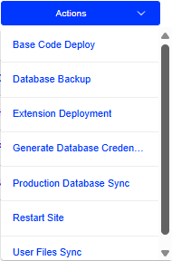
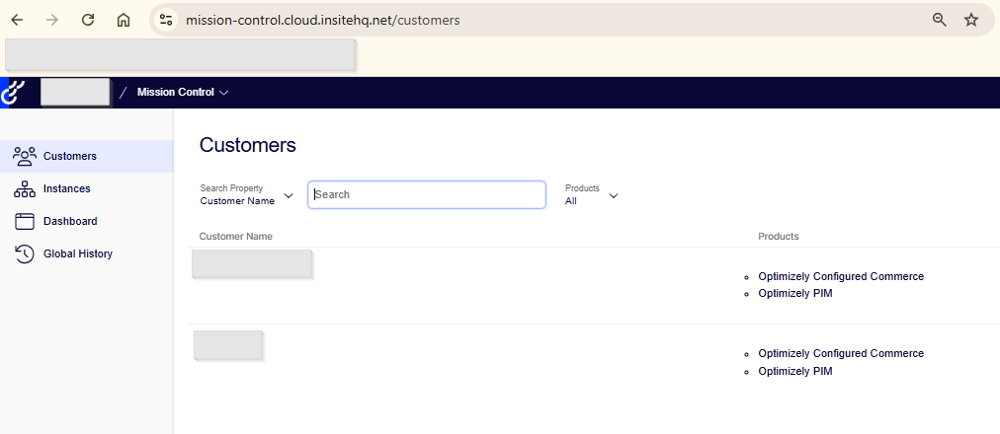
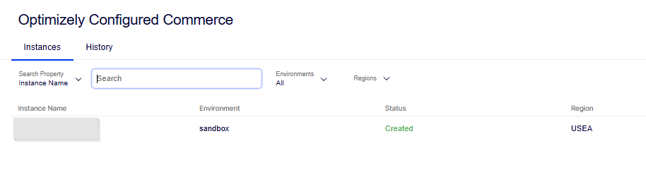
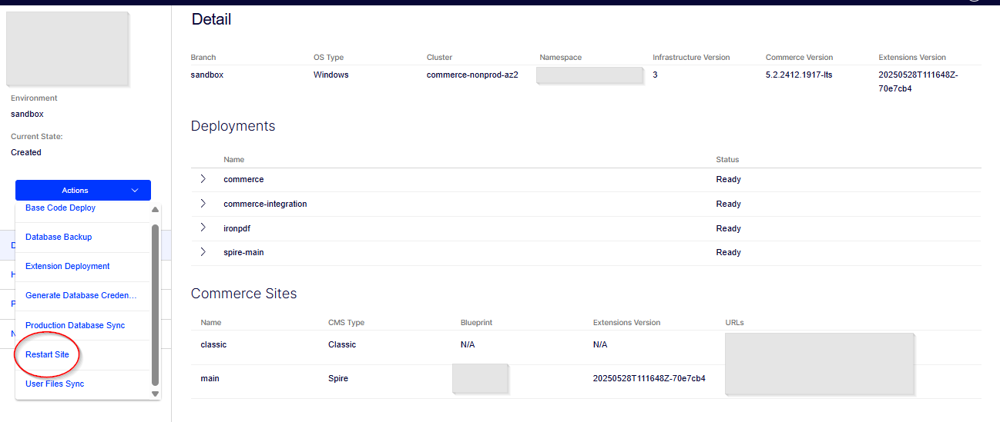
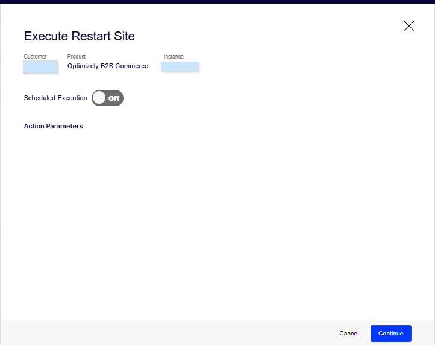
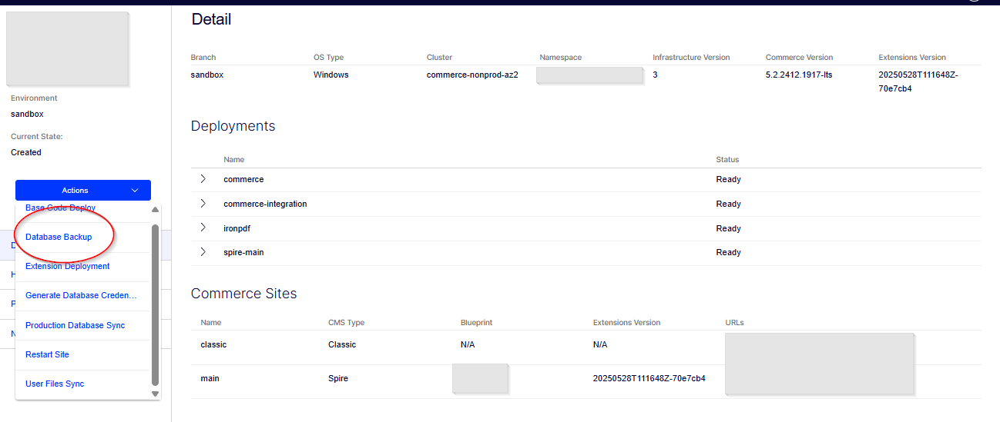
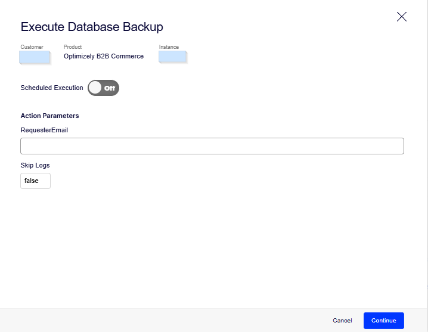
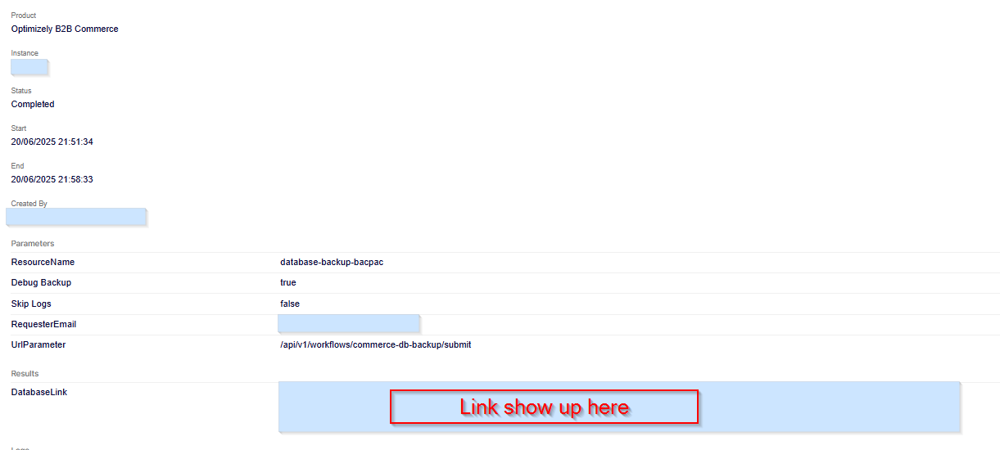

Optimizely provides powerful tools that make it easy to build, release, and manage cloud infrastructure efficiently.

## Optimizely Mission Control Access

To use this tool, an **Opti ID** is required. Once you have an Opti ID, request that your organization grants access to your user account. Alternatively, you can raise a ticket with the **Optimizely Support** team along with approval from your project organization.

## Key Actions

Mission Control provides the following essential actions for managing your cloud environments:

- **Restart Site** — Restart the application in a specific environment to apply changes or resolve issues.
- **Database Backup** — Create a backup of the environment's database for debug purposes.
- **Generate Database Credentials** — Generate secure credentials to connect to the environment's database.
- **Base Code Deploy** — Deploy the base application code to the selected environment.
- **Extension Deployment** — Deploy any custom extension changes.
- **Production User Files Sync** — Synchronize user-generated files (e.g., media, documents) from production to lower environments.
- **Production Database Sync** — Sync the production database to another lower environment (such as a sandbox).

Let's walk through each of these actions step by step.

---

## Restart Site

The **Restart Site** option is handy when a website restart is required due to configuration changes. For example, updates to the storage or search provider often require a restart. Additionally, if an integration job gets stuck, the ability to restart the site restores normal functionality.

### How to restart the website

1. Log in to **Mission Control**.
2. Navigate to the **Customers** tab.
3. Select the appropriate **Customer**.

4. Choose the **Environment** where the restart is needed.

5. Click on the **Action** dropdown in the left pane.

6. Select **Restart Site** from the list.
7. A pop-up will appear — either **schedule the restart** or click **Continue** for an **immediate restart**.

**Reference:** [Restart Site – Optimizely Support](https://support.optimizely.com/hc/en-us/articles/29755553302797-Restart-Site)

---

## Database Backup

Using this option, you can take a backup from a Sandbox or Production instance and import it into the local environment to debug issues. The backup file is generated with a `.bacpac` extension.

### Steps to take a backup

1. Log in to **Mission Control**.
2. Navigate to the **Customers** tab.
3. Select **Database Backup** from the list.

4. A pop-up will appear prompting for a scheduled backup time.
5. Set **Skip Log** to **False** to minimize the backup size.

6. Click **Continue** and wait for the process to complete.
7. Once finished, click the provided link to **download the backup file**.

**Reference:** [Database Backup – Optimizely Support](https://support.optimizely.com/hc/en-us/articles/29756299053965-Database-Backup)

---

Stay tuned for **Part II** — covering Generate Database Credentials, Base Code Deploy, Extension Deployment, and Production Sync features.
